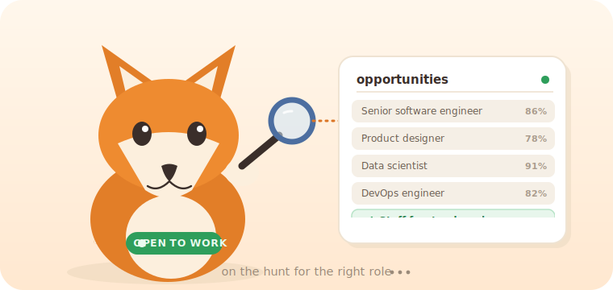

# Foxhound

<p align="center">
  
</p>

**An autonomous AI career agent that finds jobs matching your résumé, applies to them for you, and tracks every application through to an offer.**

Foxhound runs a personal agent for each user. It discovers roles across the open web, scores them against your profile, auto-fills and submits applications on ATS platforms (Greenhouse, Lever, Workday, …), researches companies before you apply, preps you for interviews, and keeps a live record of every application's status. You talk to it in plain language over the web app, Slack, Discord, or SMS.

> **Status:** early access · actively developed.

---

## Features

- **Conversational agent** — one agent per user with streaming chat (SSE), driven by an Anthropic Claude tool-calling loop wrapped in code-enforced safety guards (tier limits, duplicate/blacklist checks, confirmation gates).
- **Job discovery** — searches the live web via headless browser automation, beyond a saved job database, returning structured listings.
- **Auto-apply** — fills and submits ATS application forms, drafts answers to screening questions, reuses a per-user "answer bank", and blocks duplicate or blacklisted applications.
- **Company recon & briefs** — synthesizes hiring velocity, tech stack, and an insider tip from public company pages before you apply.
- **Interview prep** — aggregates company-specific interview questions and experiences from public sources.
- **Networking map** — surfaces potential warm connections at a target company.
- **Ghost-job detection** — flags likely fake or stale postings.
- **Match ranking** — LightGBM / SetFit models score relevance against your profile.
- **Multi-channel** — web, Slack, Discord, and Twilio SMS, all with verified request signatures.
- **Dashboard, activity feed, watchdog & notifications** — proactive updates as applications progress.

## Architecture

```
            Web (Next.js)   Slack   Discord   SMS (Twilio)
                    \         |        |        /
                     \________|________|_______/
                                 │  (signature-verified)
                          FastAPI backend  ──►  Anthropic Claude  (agent tool-calling loop)
                                 │
        ┌────────────────┬───────┴────────┬──────────────────┐
        ▼                ▼                ▼                  ▼
   Supabase        TinyFish          Fly.io             ML models
 (Postgres + RLS   (remote headless  (sandbox           (LightGBM /
  + Auth + Storage) browser / apply)  preview machines)  SetFit ranking)
```

| Layer | Technology |
|---|---|
| Backend | FastAPI · async SQLAlchemy · Python 3.11–3.12 · [uv](https://docs.astral.sh/uv/) |
| Frontend | Next.js (in [`ui/`](ui/)) |
| Data & auth | Supabase — Postgres, Auth (JWT), Row-Level Security, Storage (résumés) |
| LLM | Anthropic Claude (configurable model tiers) via the Anthropic API |
| Browser automation | TinyFish (remote headless browser over CDP — no local browser needed) |
| Preview sandboxes | Fly.io machines |
| Packaging & deploy | Docker → Fly.io |

## Getting started

### Prerequisites

- Python **3.11 or 3.12**
- [`uv`](https://docs.astral.sh/uv/) (dependency manager)
- Node.js 18+ (for the `ui/` frontend)
- A Supabase project (Postgres + Auth + Storage)
- API keys — at minimum **Anthropic** and **TinyFish**. See [`.env.example`](.env.example) for the full list.

### 1. Backend (API)

```bash
# from the repo root
uv sync --extra dev                 # install runtime + dev dependencies
cp .env.example .env                # then fill in your keys

# run the API — single worker is required (in-memory token store)
uv run uvicorn app.main:app --reload --port 8000
```

The app creates its tables on boot (`init_db()`). Apply the SQL in [`supabase/migrations/`](supabase/migrations/) to your Supabase project to enable the Row-Level Security policies. For a zero-config local run you can point `DATABASE_URL` at SQLite (`sqlite+aiosqlite:///./foxhound.db`); production uses Postgres.

### 2. Frontend (web app)

```bash
cd ui
npm install
npm run dev                         # Next.js dev server on http://localhost:3000
```

Make sure `FOXHOUND_CORS_ORIGINS` includes the frontend origin (it defaults to `http://localhost:3000`).

### 3. CLI (optional)

```bash
uv run foxhound --help              # opportunity-intelligence commands from the terminal
```

### Tests & linting

```bash
make lint     # ruff check + format check + eslint
make test     # pytest
make check    # lint + test + frontend build (run before pushing)
```

## Project structure

```
app/
  api/           FastAPI routes, schemas, rate limiting
  services/      agent loop + tools, apply pipeline, ingest, recon, notifications
  db/            SQLAlchemy models + session
  ml/            relevance + ranking models
  autoresearch/  self-tuning research loop
  core/          config, logging, errors
  cli.py         command-line interface
  main.py        FastAPI application entrypoint
ui/              Next.js frontend
supabase/        SQL migrations (Row-Level Security policies)
docker/          sandbox runtime images
tests/           pytest suite
Dockerfile       production image (Fly.io)
fly.toml         Fly.io deployment config
```

## Deployment

The backend is containerized via [`Dockerfile`](Dockerfile) and deployed to Fly.io ([`fly.toml`](fly.toml)) — a single Uvicorn worker on port 8080. Provide secrets with `fly secrets set KEY=value …` (the same keys documented in `.env.example`).

## License

© 2026 Nadirah Durr. All rights reserved.

This source is published for viewing only. No license to use, copy, modify, or distribute is granted.
